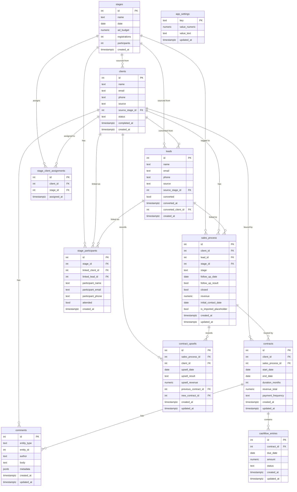

# Entity-Relationship Diagram

## Notes on relationships and notation

- Arrow notation (Mermaid ERD crow's-foot symbols):
  - `||` means "exactly one" (mandatory one) on that side.
  - `|o` or `o|` means "zero or one" (optional single) on that side.
  - `}` or `{` combined with `o` or `|` indicates "many" (crow's foot). For example:
    - `||--o{` reads: the left entity must have exactly one of the right entity, while the right entity may have zero or many of the left (a one-to-many relationship where the left side is required).
    - In domain terms `clients ||--o{ sales_process` means a client may have zero or many sales_process rows, and each sales_process must be associated with exactly one client.

- The label `trusted by` on the arrow between `sales_process` and `contracts` is a human-friendly description (not enforced by the DB). It indicates the domain intent: a `contract` typically originates from a `sales_process` (the sales process is the event that led to the contract), so the application "trusts" the sales_process as the source of truth for why the contract exists. In SQL terms this relationship is implemented by `contracts.sales_process_id` being a foreign key to `sales_process.id` (nullable — contracts created by the importer may not have a linked sales_process).

- `contracts.end_date` is a plain nullable DATE column (not a generated/computed column). It is set by the importer from the source data; the application may also set it manually.

- `sales_process.is_imported_placeholder` is TRUE for rows inserted automatically by the CSV importer to satisfy the FK requirement for imported contracts. These rows are not real sales process records and should be filtered out of sales pipeline reports.

- `comments` uses a polymorphic `entity_type` / `entity_id` pattern rather than per-table foreign keys. Valid entity_type values include `'client'`, `'sales_process'`, `'contract'`, and `'lead'`. The diagram shows explicit arrows only for the most common targets (clients, contracts).

- Practical meanings of the relationships in this domain model:
  - `clients ||--o{ sales_process : "has"`
    - A client is required for a sales_process (a sales process cannot exist without a client). A client can have zero or many sales processes over time.
  - `clients ||--o{ leads : "converted from"`
    - When a lead converts into a paying client, `leads.converted_client_id` is set to the new client's id. The arrow direction here means "a lead may reference at most one converted client; a client may be the conversion target of zero or many leads".
  - `leads ||--o{ sales_process : "linked to"`
    - A sales process may optionally be linked back to the lead record it originated from via `sales_process.lead_id`.
  - `stages ||--o{ clients` and `stages ||--o{ leads : "sourced from"`
    - `clients.source_stage_id` and `leads.source_stage_id` record which marketing stage (event/webinar/campaign) the person first came through.
  - `sales_process ||--o{ contracts : "trusted by"`
    - A contract is associated with a sales_process that produced it. A sales_process may produce zero or many contracts (for example, renewal or upsell contracts). `contracts.sales_process_id` is nullable for importer-created contracts.
  - `contracts ||--o{ cashflow_entries : "contains"`
    - A contract may contain zero or many cashflow entries (scheduled payments). Each cashflow entry belongs to exactly one contract.
  - `sales_process ||--o{ contract_upsells : "records"`
    - Upsell attempts/results are attached to a sales_process. A sales_process can record multiple upsell attempts or results.
  - `stages ||--o{ stage_participants : "has"` and `stages ||--o{ stage_client_assignments : "assigns"`
    - Stages track attendance (stage_participants) and explicit client assignments (stage_client_assignments). Participants can be linked to either a client or a lead record.
