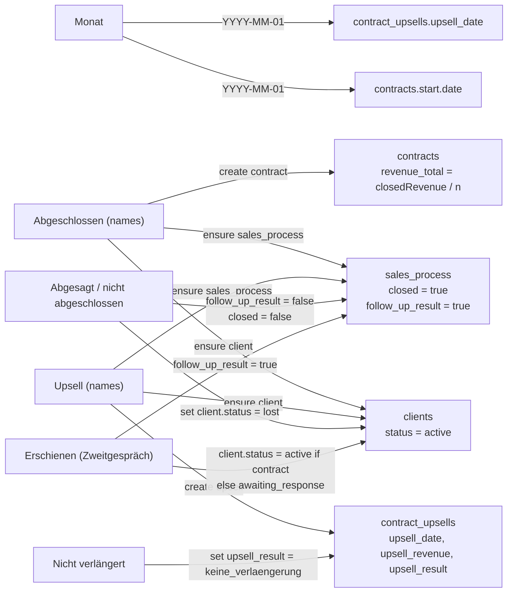
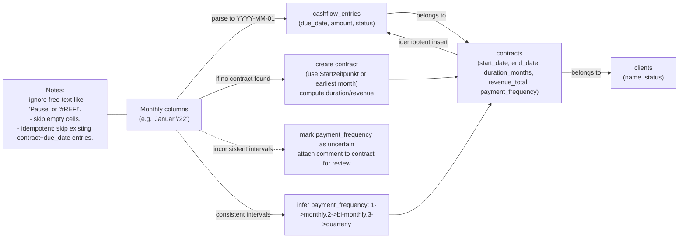

# CSV -> DB mapping (Salesprozess_Ausschnitt.csv)

This file documents the mapping rules used by `tools/importsales` and shows a small Mermaid diagram you can render on GitHub or in the Mermaid Live Editor.

## Rules (short)

- `Monat` -> contract.start_date and contract_upsells.upsell_date: parsed as YYYY-MM-01 using `-year` if needed.

- `Abgeschlossen` -> clients (ensure), sales_process (closed=true), contracts (create, revenue split evenly), comments for parenthetical notes.

- `Abgeschlossener Umsatz` -> contracts.revenue_total (split evenly among names on that row).

- `Upsell` -> clients (ensure), sales_process (ensure/create), contract_upsells (upsell_date, upsell_revenue, upsell_result). `upsell_result='verlaengerung'` means an upsell (true). If the same name appears in `nicht verlängert`, `upsell_result='keine_verlaengerung'`.

- `nicht verlängert` -> create `contract_upsells` with `upsell_result='keine_verlaengerung'`, `upsell_date = Monat-01` (no comment needed).

- `Abgesagt / nicht abgeschlossen` -> Zweitgespräch didn't take place: set `sales_process.follow_up_result = false`, `closed = false`, `stage = 'lost'`, `clients.status = 'lost'`.

- `Erschienen` (Zweitgespräch attended) -> set `sales_process.follow_up_result = true`. Set `clients.status = 'active'` if the client already has a contract / cashflow evidence, otherwise `awaiting_response`.

- Aggregate metrics (Umsatz brutto, quotes, coaches etc.) should not be written to `app_settings`. Keep them in a monthly analytics table or external report.

## Mermaid diagram

Paste this into a Markdown file that supports Mermaid (or use the Live Editor):



If you want I can also commit a diagrams.net (.drawio) source file and export SVG/PNG versions for documentation.

## Notes

- Use `-year` with `tools/importsales` to disambiguate month-only strings in `Monat`.
- Use `-import-tag` to tag created/updated clients for revertability.
- The importer enforces idempotency checks for comments, contracts and upsells; consider adding a revert helper if you need to roll back an import by tag.

---

If you want I can also commit a diagrams.net (.drawio) source file and export SVG/PNG versions for documentation.

## Cashflow CSV -> DB mapping (Cashflow_Ausschnitt.csv)

This section documents how the cashflow extractor/importer should interpret the columns of `Cashflow_Ausschnitt.csv` and how they map to domain tables (`clients`, `contracts`, `cashflow_entries`, and `comments`). The CSV contains per-month payment cells (many columns named like `Januar '22`) that represent scheduled or historical receipts.

Key column -> DB target / behavior
- `Nr.` (optional)
  - ignore for domain model (keeps source ordering only)
- `Name`, `Vorname`
  - Combine to a single client name and map to `clients.name` (use existing finder to match by name/email). If no existing client, create one and set `clients.status = 'active'` when cashflow is present.
- `Startzeitpunkt`
  - Parse as date -> candidate for `contracts.start_date` when creating a contract for this client.
- `Endzeitpunkt`
  - Map to `contracts.end_date` if present (used to close contracts and avoid future scheduled cashflow entries).
- `Programm`
  - Contextual program name. Store as a `comments` entry attached to the client or contract (use `comments.metadata` to hold structured program info) so it’s queryable without schema changes.
- `Fortsetzung Ja/Nein`
  - Indicates continuation/renewal intent. Store as a comment or, if you want structured analysis, create a `contract_upsells` row with `upsell_result = 'verlaengerung'` (when yes) or `keine_verlaengerung` (when no). For now prefer a comment to avoid automatic contract creation decisions.
- `Kommentar`
  - Persist to `comments` on the `client` (entity_type='client') with metadata containing the original CSV row reference.
- `CLV`
  - Customer lifetime value estimate. Store in `comments.metadata` or a dedicated analytics table; not mapped to `clients` table directly.
- Monthly columns (e.g., `Dezember '21`, `Januar '22`, ...)
  - Each non-empty numeric cell represents an amount that occurred (or is scheduled) in that month. For each non-zero cell:
    - Ensure there is a `contract` for the client (find-or-create; if creating, use `Startzeitpunkt` and infer `duration_months` or set a default).
    - Insert a `cashflow_entries` row with:
      - `contract_id` = the contract used
      - `due_date` = first day of the corresponding month (e.g., 2022-01-01)
      - `amount` = parsed numeric value
      - `status` = 'paid' if the CSV indicates paid; otherwise 'pending' (the extractor can default to 'paid' if the column is historical or to 'pending' for future scheduled months).

Processing notes & heuristics
- Deduplicate: if a cashflow entry for the same contract + due_date already exists, skip or update depending on `-persist` policy.
- Contract discovery: prefer matching by client name + overlapping start_date range; if multiple contracts match, attach amounts to the open contract (end_date IS NULL) or the one whose start_date is closest prior to the monthly column.
- Due date choice: using the first day of the month keeps the date arithmetic simple and works with `cashflow.go` queries which use month truncation.

Example SQL checks used by importer
- Has active contract?
```sql
SELECT id FROM contracts WHERE client_id = $1 AND end_date IS NULL LIMIT 1;
```
- Insert cashflow entry (idempotent guard):
```sql
SELECT id FROM cashflow_entries WHERE contract_id=$1 AND due_date=$2 LIMIT 1;
-- if not found INSERT INTO cashflow_entries (contract_id,due_date,amount,status) VALUES (...) 
```

Reporting / analytics
- The cashflow extractor feeds `cashflow_entries`, and `cashflow.go` aggregates `confirmed` and `potential` amounts across months. Keep monthly aggregates out of `app_settings` and rely on the `cashflow_entries` + `contracts` + `sales_process` tables for forecasts.

If you want, I can add a small Mermaid sub-diagram to this file showing cashflow → contract → client relationships and/or implement the importer logic to auto-create contracts from rows where a contract is missing. Let me know which you prefer (doc-only vs code+tests).

## Mermaid diagram (Cashflow CSV -> DB)

Paste this into a Markdown file that supports Mermaid (or use the Live Editor):


