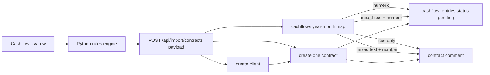

# Cashflow CSV -> DB mapping

This file documents the **current** `Cashflow.csv` import flow.

It reflects the rule-based pipeline via `tools/import_specs/cashflow_rules.yaml` and the Go backend import endpoint at `POST /api/import/contracts`.

## Current `Cashflow.csv` importer

This section documents the **current** import path for `Cashflow.csv`.

Today the import is a two-step pipeline:

1. `tools/run_import.py` reads `Cashflow.csv` using `tools/import_specs/cashflow_rules.yaml`
2. the transformed payload is POSTed to `POST /api/import/contracts`

Important: this is currently a **migration-style import**, not an idempotent incremental sync.

- the API import endpoint truncates `cashflow_entries`, `comments`, `contracts`, and `clients`
- it is blocked in production
- it requires header `X-Migration-Key: ALLOW_MIGRATION`

### Source file shape

The current importer expects the wide spreadsheet layout used by [Cashflow.csv](Cashflow.csv):

- a first metadata row is skipped
- the second row is treated as the header row
- fixed columns such as `Name`, `Vorname`, `Startzeitpunkt`, `Endzeitpunkt`, `CLV`
- many dynamic month columns like `Januar '22`, `Februar '23`, `März '26`, etc.

### Rule-engine mapping (`tools/import_specs/cashflow_rules.yaml`)

The Python rules currently map the CSV like this:

- `Name` -> temporary field `lastname`
- `Vorname` -> temporary field `firstname`
- computed `name` = `firstname + ' ' + lastname`
- `Startzeitpunkt` -> `contract_start`
- `Endzeitpunkt` -> `contract_end`
- `CLV` -> `clv`
- all month-like columns matching `[A-Za-zäöüÄÖÜ]+ '\d{2}` -> `cashflows` map

So a row such as:

- `Name = Doe`
- `Vorname = Jane`

becomes payload name:

- `Jane Doe`

### Backend payload shape

`POST /api/import/contracts` currently accepts records shaped like:

```json
{
  "name": "Jane Doe",
  "contract_start": "2024-04-12",
  "contract_end": "2025-12-22",
  "cashflows": {
    "2024-09": 900,
    "2024-12": "900 €",
    "2025-05": "Pause"
  },
  "is_former": false
}
```

### Current DB behavior per imported row

For each transformed row, the backend currently does the following:

1. Parse `contract_start` and `contract_end`
2. Insert **one** client
3. Insert **one** contract for that client
4. Insert cashflow entries and/or comments from the `cashflows` month map

This means the current importer is **one CSV row -> one client -> one contract**.

### Column / field mapping to domain tables

#### `Name` + `Vorname`

- combined into one display name
- stored as `clients.name`
- no fuzzy matching / reuse in the current migration path because the import truncates and recreates records

#### `Startzeitpunkt`

- parsed upstream and sent as `contract_start`
- stored as `contracts.start_date`

#### `Endzeitpunkt`

- parsed upstream and sent as `contract_end`
- stored as `contracts.end_date`

#### `CLV`

- currently extracted by the Python rule engine
- currently **not persisted** by the Go import endpoint
- effectively informational only at the moment

#### Former-client handling

- the Go endpoint supports `is_former`
- when `is_former = true`, the created client gets `clients.status = 'inactive'`
- otherwise the client gets `clients.status = 'active'`

Note: `is_former` is supported by the backend import endpoint, but it is not derived from `CLV` itself. If the upstream importer marks rows after the `Ehemalige` section as former, that flag is what the backend uses.

### Monthly cashflow column behavior

Each month cell is collected into the `cashflows` map using normalized year-month keys like:

- `2024-09`
- `2025-12`
- `2026-03`

The backend then processes each `cashflows[YYYY-MM]` value as follows:

#### Numeric values

- if the month value is numeric and non-zero:
  - insert one row into `cashflow_entries`
  - `due_date` = first day of that month
  - `amount` = parsed numeric amount
  - `status` = `'pending'`

Example:

- `"2025-10": 900`

becomes roughly:

```sql
INSERT INTO cashflow_entries (contract_id, due_date, amount, status)
VALUES ($contract_id, '2025-10-01', 900, 'pending');
```

#### String values containing a number

- if the value is a string but contains a numeric fragment, the importer:
  - inserts a `cashflow_entries` row using the first parsed number
  - and, if text remains, also inserts a `comments` row on the contract

Examples from [Cashflow.csv](Cashflow.csv):

- `"271,43"` -> numeric cashflow entry
- `"? 190"` -> cashflow entry for `190` **plus** comment
- `"Pause 300"` -> cashflow entry for `300` **plus** comment

Comment format currently used:

- `entity_type = 'contract'`
- `author = 'importer'`
- `body = '<YYYY-MM>: <original cell text>'`

#### Pure text values

- if a month cell contains only text and no numeric fragment, no cashflow row is created
- instead a contract comment is created

Examples:

- `Pause`
- `pause`
- `Pause (Verletzung)`
- `hört auf`
- `geschenkt (Empfehlung)`

#### Placeholder values ignored

- empty string -> ignored
- `-` -> ignored
- numeric zero -> ignored

### Revenue and frequency derivation

The current Go importer derives contract values from the monthly map:

#### `contracts.revenue_total`

- calculated as the sum of all **positive numeric** month values discovered in `cashflows`
- text-only cells do not contribute
- ignored placeholders such as `-` do not contribute

#### `contracts.duration_months`

- derived from `contract_end - contract_start` in months
- minimum is forced to `1`

#### `contracts.payment_frequency`

- inferred from the spacing between the **first two positive due months**
- current rules:
  - only one due month -> `one-time`
  - gap >= 6 months -> `bi-yearly`
  - gap >= 3 months -> `quarterly`
  - gap >= 2 months -> `bi-monthly`
  - otherwise -> `monthly`

This is a heuristic based on the earliest detected payment months.

### Additional import details

- `clients.created_at` is backfilled from `contract_start`, so imported rows do not look newly created just because the import ran today
- `contracts` are created with `GenerateSchedule = false`
- the imported month cells themselves are the source of truth for inserted `cashflow_entries`
- imported `cashflow_entries` currently use status `'pending'`

### What the current importer does **not** do

The current `Cashflow.csv` importer does **not** currently:

- match existing clients/contracts and merge into them
- perform per-entry idempotent upserts
- persist `CLV`
- create `contract_upsells`
- infer paid vs pending from historical position in the spreadsheet

> **Note:** The importer **does** create a `sales_process` row per client, but as a placeholder (`is_imported_placeholder = TRUE`) with all fields set to NULL. It is not a real sales process — just a stub required by the data model.

### Mermaid diagram (current Cashflow import)



### Practical examples from [Cashflow.csv](Cashflow.csv)

- `900 €` -> inserts one pending cashflow entry
- `1.800 €` -> inserts one pending cashflow entry
- `?` -> inserts a contract comment only
- `Pause` -> inserts a contract comment only

---

## Record shape example

This shows the full transformation path for a real row from `Cashflow.csv`:

**Source CSV row (rows 1 = year header skipped, row 2 = real header):**

| Nr. | Name | Vorname | Startzeitpunkt | Endzeitpunkt | CLV | ... | April '24 | ... | September '24 | ... |
|-----|------|---------|----------------|--------------|-----|-----|-----------|-----|---------------|-----|
| | Doe | Jane | 12.04.2024 | 22.12.2025 | 3.600 € | | 900 € | | 900 € | |

**After Python rules engine (`cashflow_rules.yaml`):**

- `lastname = "Doe"` + `firstname = "Jane"` → `name = "Jane Doe"`
- `Startzeitpunkt = 12.04.2024` → `contract_start = "2024-04-12"`
- `Endzeitpunkt = 22.12.2025` → `contract_end = "2025-12-22"`
- `CLV` captured but not forwarded to Go (commented out in `ContractImport` struct)
- All month columns collected into `cashflows` map with normalized `YYYY-MM` keys

**Payload sent to `POST /api/import/contracts`:**

```json
{
  "name": "Jane Doe",
  "contract_start": "2024-04-12",
  "contract_end": "2025-12-22",
  "is_former": false,
  "cashflows": {
    "2024-04": 900,
    "2024-09": 900
  }
}
```

**What the Go importer inserts into the DB:**

| Table | What gets created |
|---|---|
| `clients` | `name="Jane Doe"`, `status="active"`, `created_at=2024-04-12` |
| `sales_process` | placeholder row, all fields NULL, `is_imported_placeholder=TRUE` |
| `contracts` | `start_date=2024-04-12`, `end_date=2025-12-22`, `duration_months=20`, `revenue_total=1800`, `payment_frequency="quarterly"` |
| `cashflow_entries` | two rows: `due_date=2024-04-01, amount=900, status=pending` and `due_date=2024-09-01, amount=900, status=pending` |

**Frequency inference for this example:**

- two payment months: April 2024 and September 2024
- gap = 5 months → falls in `>= 3` bucket → `quarterly`

**`is_former` effect:**

- `false` → `clients.status = "active"`
- `true` → `clients.status = "inactive"` (and if dates are invalid, the row is skipped instead of aborting)
- `-` -> ignored
- `0 €` -> ignored for cashflow entry creation

### Reporting / analytics

The imported rows feed `cashflow_entries`, and the application then builds cashflow metrics and forecasts from:

- `cashflow_entries`
- `contracts`
- `clients`

Monthly totals from the spreadsheet footer such as `CASHFLOW BRUTTO`, `CASHFLOW NETTO`, `YTD Brutto`, or free-text notes at the bottom are **not** imported into domain tables.
