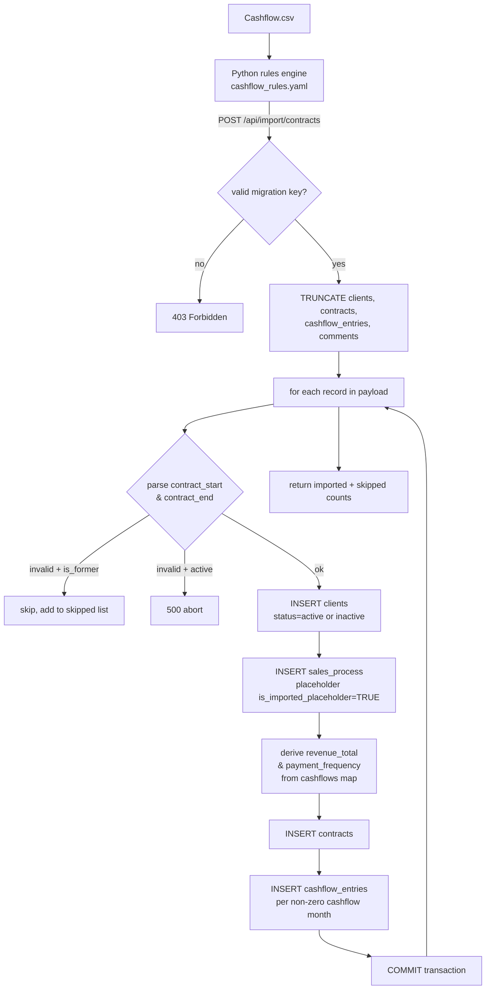

> **Note:** This diagram reflects the **current** migration-style import via `tools/run_import.py` + `POST /api/import/contracts`.
> It is **not** the old incremental/idempotent approach (no fuzzy matching, no upsells).

