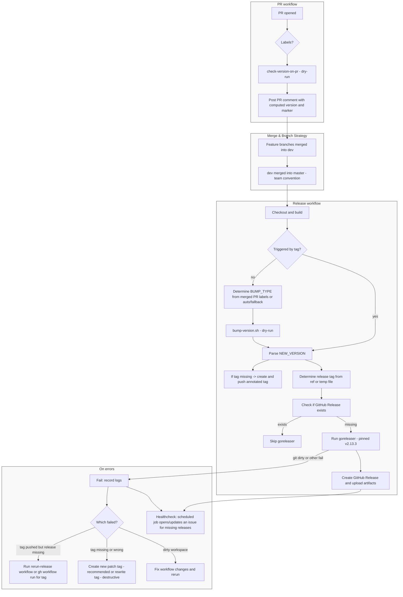

**Release Process Overview**

This document describes the repository's release process: PR checks, label-driven version computation, release workflow, tagging, and error recovery. The diagram below shows the end-to-end flow.

Key notes

- PR check (`check-version-on-pr.yml`) computes a candidate using labels and posts a single marker-based comment with the computed version.
- Release job reads the merged PR labels (if available) to set `BUMP_TYPE` before re-computing the tag on `master`.
- If no matching PR label is found, the current bump script falls back to a patch bump unless label enforcement is explicitly enabled.
- The release job uses `bump-version.sh --dry-run` and avoids mutating tracked files to prevent `goreleaser` "dirty" errors.
- The release job currently runs `go build ./...` before releasing; it does not run `go test` in that workflow.
- Tag creation is guarded: only create the annotated tag if it doesn't already exist; if a race occurs, the job tolerates existing-tag cases.
- `dev -> master` is a branch strategy convention, not something enforced by the release workflow itself; the workflow triggers on pushes to `master` and on version tags.
- Recovery paths: `rerun-release.yml` lets you re-run goreleaser for a tag. A scheduled healthcheck workflow also exists, but its behavior should be treated as supplemental and verified against the current workflow file.

Recommended operator actions on failure

- If goreleaser fails but the tag exists: use `gh workflow run "Release (auto)" --ref <tag>` or the `Rerun Release` workflow.
- If the tag was never pushed or points to the wrong commit: prefer creating a new patch tag (e.g. `vX.Y.Z+1`) and run release for that tag.
- Only rewrite an existing tag if you understand the impact and have coordinated with downstream consumers.

Files to review

- [`.github/workflows/check-version-on-pr.yml`](.github/workflows/check-version-on-pr.yml)
- [`.github/workflows/release-on-master.yml`](.github/workflows/release-on-master.yml)
- [`.github/scripts/bump-version.sh`](.github/scripts/bump-version.sh)
- [`.github/workflows/rerun-release.yml`](.github/workflows/rerun-release.yml)
- [`.github/workflows/release-healthcheck.yml`](.github/workflows/release-healthcheck.yml)

Current behavior summary

- PRs get a computed candidate release version comment.
- A push to `master` triggers the release workflow.
- If the workflow was not triggered by a tag push, it computes the next version, creates the annotated tag if missing, and then releases from that tag.
- If no `major` / `minor` / `patch` label is found for the merged PR, the current default behavior is a patch release.
- Direct tag pushes matching `v*.*.*` also trigger the release workflow.

If you want I can also export the diagram as an SVG or add it to the repo README.

**Testing with production data**

Dev database setup

- Go to Neon dashboard → prod project
- Click Branches → New Branch
- Select the prod branch as the parent and pick "now" (or a specific point in time)
- point the dev instance's DATABASE_URL at the new branch's connection string.
