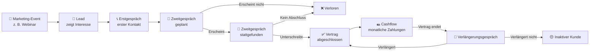
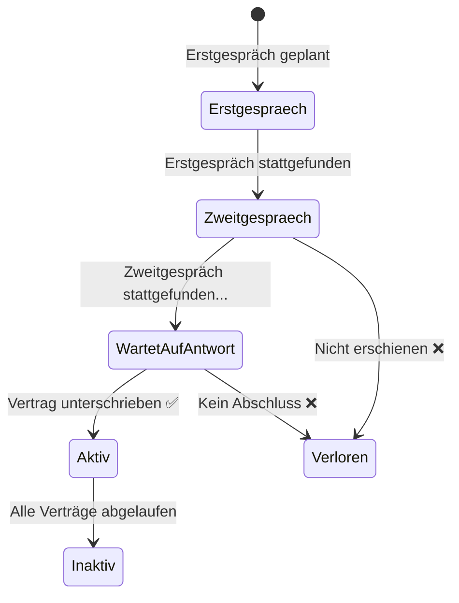
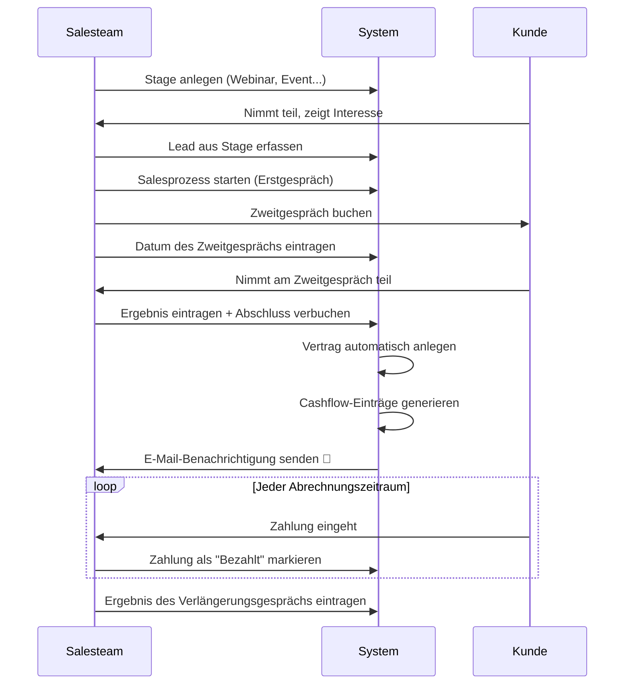
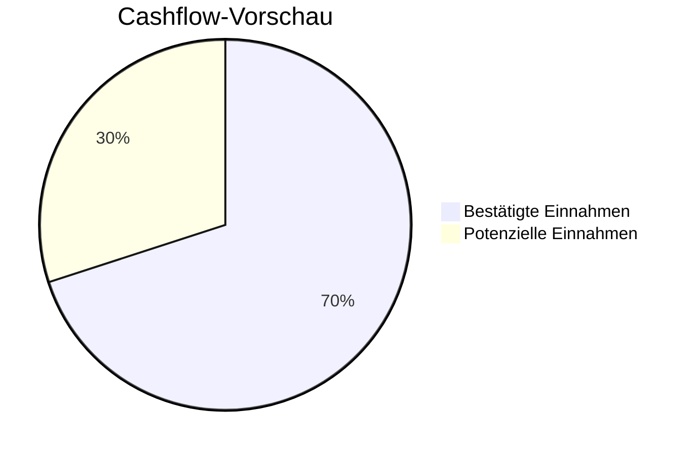
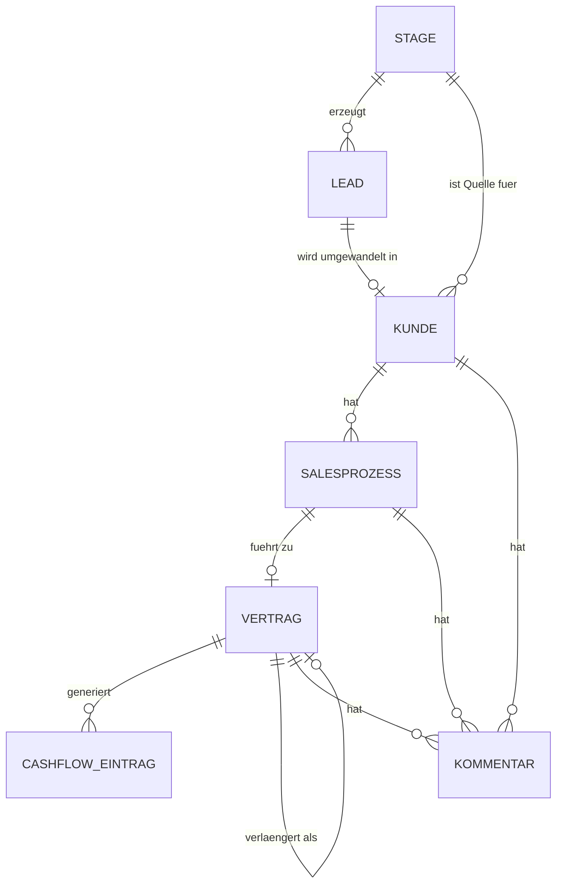

# Sales Assistant — Übersicht

Diese Übersicht erklärt, was der Sales Assistant leistet, wie die einzelnen Bereiche zusammenhängen und welchen Mehrwert das System bietet.

---

## Was ist diese Anwendung?

Der **Sales Assistant** ist ein digitales Salesmanagement-Tool. Es ersetzt manuelle Tabellen und unverbundene Notizen durch ein einziges System, das den gesamten Weg eines Kontakts verfolgt — vom ersten Marketing-Berührungspunkt (z.B. bei einem Workshop oder einem Erstgespräch) bis hin zu laufenden Zahlungen.

Man kann es sich als schlankes CRM (Customer Relationship Management) vorstellen, mit integrierter Umsatzverfolgung und Planung.

---

## Das große Bild

---

## Grundlegende Konzepte

### 1. Stages (Marketing-Events)

Eine **Stage** ist ein Marketing-Event — ein Webinar, eine Live-Veranstaltung, eine Werbekampagne oder eine ähnliche Aktivität, die Interesse weckt. Für jede Stage erfasst das System:

- Wie viel für Werbung ausgegeben wurde
- Wie viele Personen sich angemeldet haben und wie viele tatsächlich teilgenommen haben
- Wie viele dieser Teilnehmer zu Kontakten in der Salespipeline wurden
- Wie viele Abschlüsse daraus resultierten

So kann das Team genau erkennen, welche Marketing-Aktivitäten den besten Return on Investment liefern.

---

### 2. Leads

Ein **Lead** ist jemand, der Interesse gezeigt hat, aber noch keine Zusage gemacht hat. Er hat grundlegende Kontaktdaten und ist mit der Stage verknüpft, bei der er zuerst angetroffen wurde.

Wenn ein Lead schließlich einen Vertrag unterschreibt, wird er in einen Kunden **umgewandelt** und das System verfolgt diesen Weg automatisch.

---

### 3. Kunden & der Salesprozess

Ein **Kunde** ist jemand, der sich aktiv im Salesprozess befindet oder diesen bereits durchlaufen hat. Jeder Kunde hat einen **Status**, der seinen aktuellen Stand widerspiegelt:

| Status | Bedeutung |
|---|---|
| Erstgespräch geplant | Der erste Verkaufsgespräch ist gebucht |
| Zweitgespräch geplant | Ein zweites, tiefergehendes Gespräch steht im Kalender |
| Wartet auf Antwort | Zweitgespräch fand statt — Entscheidung des Kunden steht aus |
| Aktiv | Hat aktuell einen laufenden Vertrag |
| Inaktiv | Alle Verträge sind abgelaufen |
| Verloren | Salesprozess endete ohne Abschluss |

Jeder Verkaufsversuch mit einem Kunden wird als **Salesprozess** bezeichnet — ein Datensatz, der den Weg vom Erstkontakt bis zur Entscheidung dokumentiert.

---

### 4. Verträge

Wenn ein Abschluss **gewonnen** wird, wird ein Vertrag angelegt. Ein Vertrag enthält:

- Start- und Enddatum
- Den vereinbarten Gesamtwert
- Die Zahlungsaufteilung (monatlich, quartalsweise, einmalig usw.)

Das System generiert dann automatisch alle einzelnen Zahlungsdatensätze für die gesamte Vertragslaufzeit — damit nichts vergessen wird.

---

### 5. Cashflow-Einträge

Jede geplante Zahlung aus einem Vertrag ist ein **Cashflow-Eintrag**. Jeder Eintrag hat ein Fälligkeitsdatum, einen Betrag und einen Status:

| Status | Bedeutung |
|---|---|
| Confirmed | Zahlung ist geplant / steht aus |
| Overdue | Zahlung ist überfällig |

Das Team kann Zahlungen manuell als überfällig markieren.

---

### 6. Verlängerungen & Upsells

Wenn ein Vertrag sich dem Ende nähert, entsteht eine **Verlängerungsmöglichkeit**. Das Ergebnis wird festgehalten als:

- **Verlängerung** — Der Kunde hat verlängert (neuer Vertrag wird angelegt und mit dem alten verknüpft)
- **Keine Verlängerung** — Der Kunde hat nicht verlängert

Dies ermöglicht eine klare **Verlängerungsquote** über die Zeit.

---

## Der vollständige Ablauf — Schritt für Schritt

---

## Funktionen im Überblick

### Dashboard

Eine einzige Ansicht mit allen wichtigen Geschäftskennzahlen für einen beliebigen Zeitraum abzüglich MwSt:

| Kennzahl | Was sie zeigt |
|---|---|
| Neukundenerlöse | Einnahmen von Erstkunden im Zeitraum |
| Verlängerungserlöse | Einnahmen von Kunden, die verlängert haben |
| Gesamtumsatz | Summe aller Vertragswerte (Neu- und Verlängerungen), deren Startdatum im gewählten Zeitraum liegt — zeigt also, wie viel Umsatz in diesem Zeitraum **neu abgeschlossen** wurde |
| Aktiver Umsatz | Summe der Vertragswerte aller Verträge, die **heute noch laufen** (unabhängig vom Zeitraumfilter) — zeigt das aktuelle Umsatzvolumen im Bestand |
| Abschlussquote | % der Verkaufsgespräche, die zu einem Abschluss führten |
| Verlängerungsquote | % der Upsell Gespräche, deren Ergebnis Verlängerung ist |
| Durchschnittlicher Vertragswert | Typische Abschlussgröße |
| Customer Lifetime Value (CLV) | Gesamtumsatz pro Kunde über alle Zeit |

---

### Cashflow-Vorschau

Die Vorschau liefert eine **monatsweise Übersicht der erwarteten Einnahmen**, aufgeteilt in zwei Kategorien:

- **Bestätigt** — Zahlungen aus bereits unterzeichneten Verträgen
- **Potenziell** — erwartete Einnahmen aus offenen Salesprozessen, bei denen ein Zweitgespräch geplant oder bereits stattgefunden hat (und die Person erschienen ist), aber noch kein Abschluss erzielt wurde — basierend auf dem genannten Auftragswert oder einem hinterlegten Durchschnittswert

Das hilft dem Unternehmen, vorausschauend zu planen und Liquiditätslücken frühzeitig zu erkennen.

---

### Fragen in natürlicher Sprache stellen (NLQ)

Das System enthält eine **KI-gestützte Abfragefunktion** (Claude). Anstatt technische Berichte anzufordern, kann jede Person eine einfache Frage eintippen, zum Beispiel:

> *„Zeige mir alle Kunden mit geplantem Zweitgespräch diese Woche"*
> *„Welche Verträge laufen nächsten Monat aus?"*
> *„Wie hoch ist der Gesamtumsatz aus dem letzten Webinar?"*

Das System übersetzt die Frage in eine Datenbankabfrage und liefert die Ergebnisse — ohne SQL- oder technische Kenntnisse.

---

### Exporte

Das Team kann jederzeit CSV-Tabellenexporte herunterladen:

- Alle Kunden
- Alle Verträge
- Alle Cashflow-Einträge (Einzelzahlungen)
- Cashflow aggregiert nach Monat

Diese können in Excel oder Google Sheets für individuelle Auswertungen geöffnet werden.

---

### Import historischer Daten

Das System enthält eine einmalige Import-Pipeline, um historische Daten aus Tabellen in das System zu übertragen — einschließlich alter Verträge, Zahlungshistorien und Verlängerungen — damit das Team mit einem vollständigen Bild startet, nicht mit einer leeren Datenbank.

---

### Kommentare

Notizen und Kommentare können zu jedem Datensatz hinzugefügt werden — einem Kunden, einem Salesprozess, einem Vertrag oder einem Lead — damit Kontext und Kommunikationsverlauf an einem Ort bleiben.

---

### Zugang & Sicherheit

- Teammitglieder melden sich mit ihrem **Google-Konto** an — kein separates Passwort nötig
- Nur freigegebene E-Mail-Adressen haben Zugang zum System
- Alle Daten sind durch Authentifizierung geschützt

---

## Wie alles zusammenhängt

Jede Information lässt sich zurückverfolgen — welches Event, welches Gespräch, welcher Vertrag — und gibt dem Team vollständige Transparenz vom ersten Kontakt bis zur letzten Zahlung.

---

## Zusammenfassung

| Das System hilft dabei, ... | Indem es ... |
|---|---|
| Die Herkunft jedes Interessenten zu kennen | Leads und Kunden mit Marketing-Stages verknüpft |
| Kein Verkaufsgespräch zu vergessen | Jeden Schritt des Salesprozesses verfolgt |
| Umsätze klar zu überblicken | Zahlungspläne aus jedem Vertrag generiert |
| Finanziell vorausschauend zu planen | Bestätigte und potenzielle Cashflows monatlich vorausberechnet |
| Zu verstehen, was funktioniert | Abschluss- und Verlängerungsquoten sowie ROI pro Event misst |
| Fragen ohne IT-Unterstützung zu stellen | KI-gestützte Abfragen in natürlicher Sprache ermöglicht |
| Daten einfach zu teilen | CSV-Exporte mit einem Klick bereitstellt |
